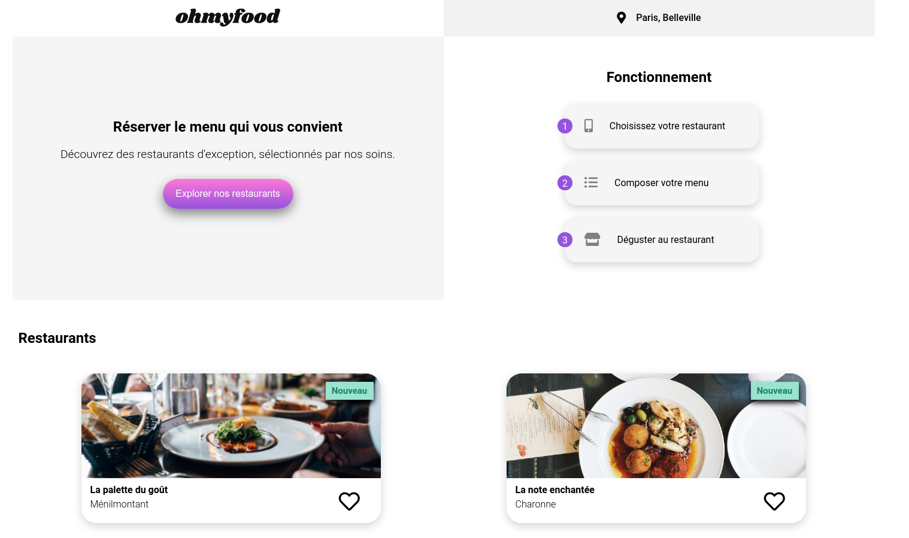

# OhMyFood

## Presentation of the context

Ohmyfood! is a young startup that would like to impose itself on the catering market.

## What this project taught me to practice

### Skills

* Cutting and integration of a model,
* structure a web page with HTML5,
* format a web page with CSS3,
* create animations with CSS.

### Technologies / methods

* Positioning with Grid and FlexBox,
* CSS with SaSS,
* BEM naming convention,
* responsive design with media queries.

## Expected deliverables

### Page content

Home page :

* display of the location of restaurants,
* a section containing the 4 menus in card form,
* when clicking on the map, the user is redirected to the menu page.

Menu Pages:

* 4 pages of each containing the menu of a restaurant.

Footer:

* the footer is identical on all pages,
* when you click on contact, a referral to an email address is made.

Header:

* the header is present on all pages,
* on the home page, it contains the site logo,
* on the menu pages, it also contains a button to return to the home page.

### Graphic effects and animations

Effects accessible by clicking or hovering are visible on the model.

They should use CSS animations or transitions only.

Buttons:

* on hover, the background color of the main buttons should lighten slightly,
* the drop shadow should also be more visible,
* a heart-shaped "Like" button is present on the model,
* on click, it should fill gradually,
* for this first version, the effect can appear on hover on desktop instead of click.

Home page :

* when the application will have more menus, a “loading spinner” will be necessary,
* on this model, we want to have a preview. It should appear for 1 to 3 seconds when you get to the home page, cover the entire screen, and use CSS animations (no library),
* the design of this loader is not defined, any proposal is therefore welcome as long as it is consistent with the graphic charter of the site.

Menu Pages:
* upon arrival on the page, the dishes should appear gradually with a slight time lag,
* they can either appear one by one, or by group “Starter”, “Main course” and “Dessert”,
* an example of the expected effect is provided,
* the visitor can add the dishes he wants to his order by clicking on it,
* this makes a small tick appear to the right of the dish,
* this tick must slide from right to left,
* for this first version, the effect can appear on hover on desktop instead of click,
* if the title of the dish is too long, it will have to be cropped with ellipsis,
* an example of the expected effect is provided.

## To my disposition

I had the mobile model of the site.

The tablet and desktop adaptation was free.

## Instructions

### Graphic identity

Fonts:
* logo and title: Shirkhand,
* text: Roboto.

Colors:
* primary: #9356DC,
* secondary: #FF79DA,
* tertiary: #99E2D0.

### Technologies

The development is in CSS, without javascript.

No framework used.

Use of SaSS recommended.

### Compatibility

Mobile-first approach.

The entire site had to be responsive.

The code had to comply with W3C standards.

